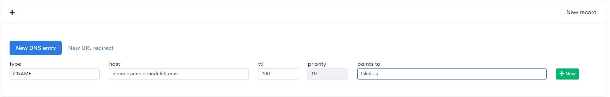
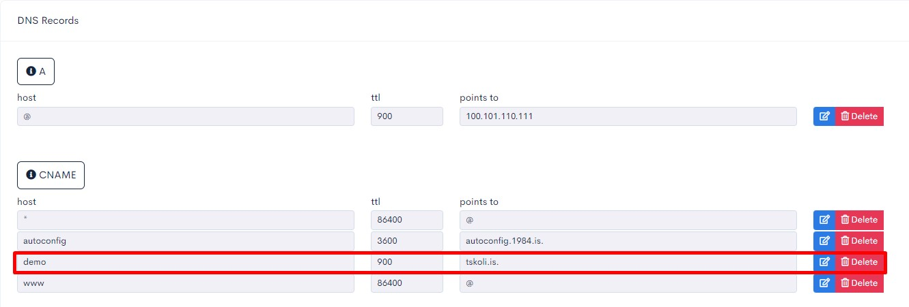

# Back End DNS

## Adding new domain

I selected the correct IP address of my server when I added the new DNS zone. Please refer to the next image on how to edit it.

## Editing server IP address

## Adding CNAME record

Adding CNAME record to demo.example.module5.com to point to tskoli.is

## CNAME record pointing to tskoli.is

